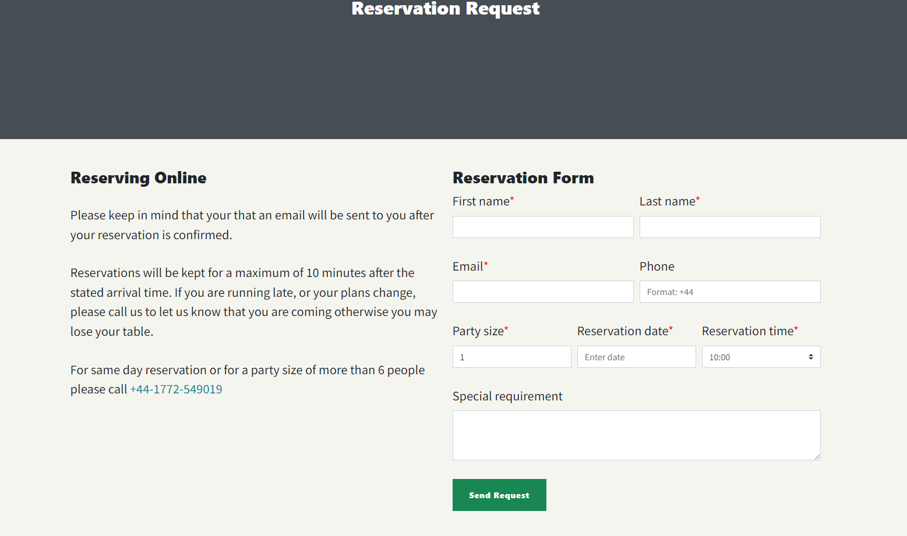
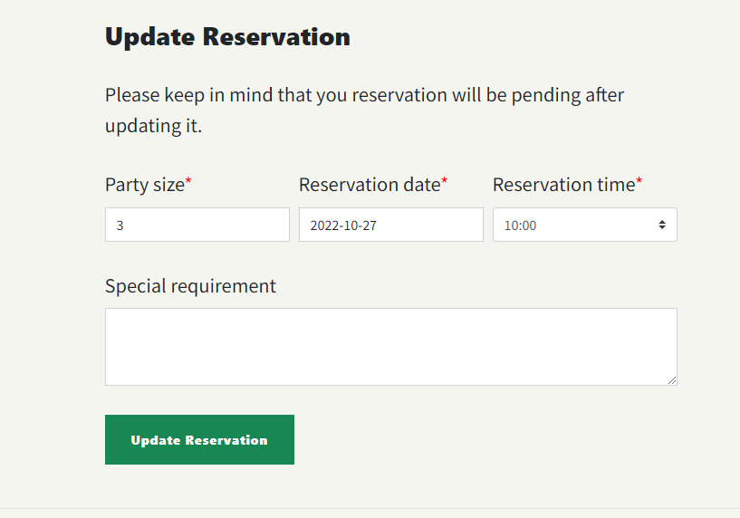
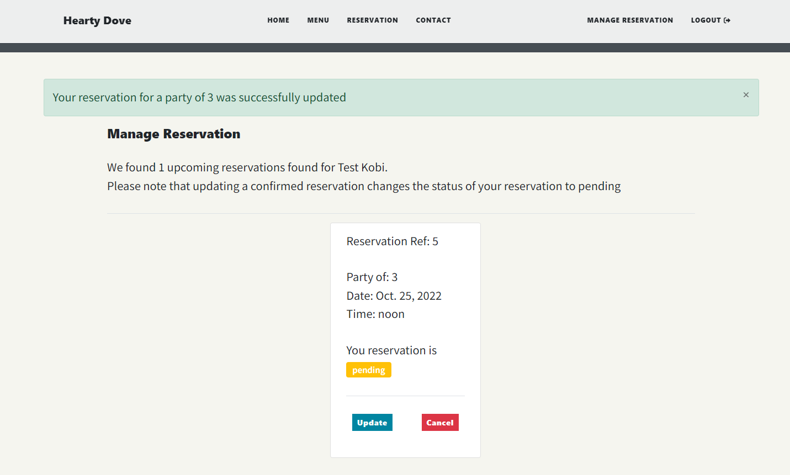
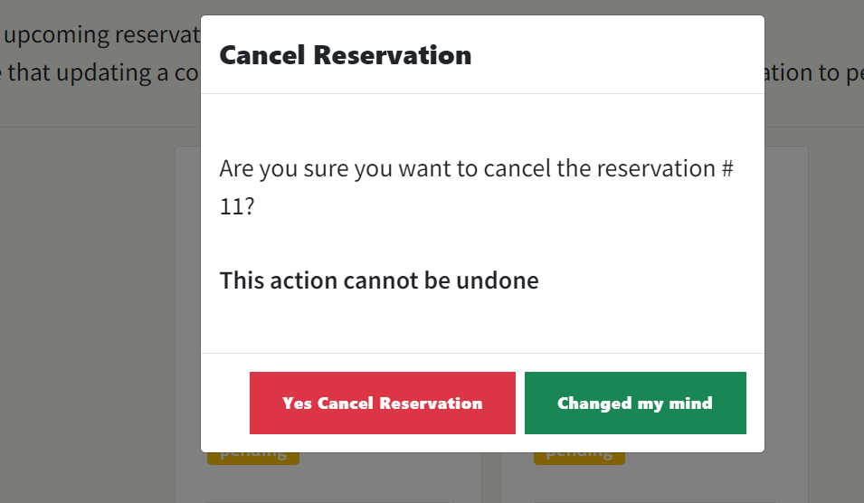
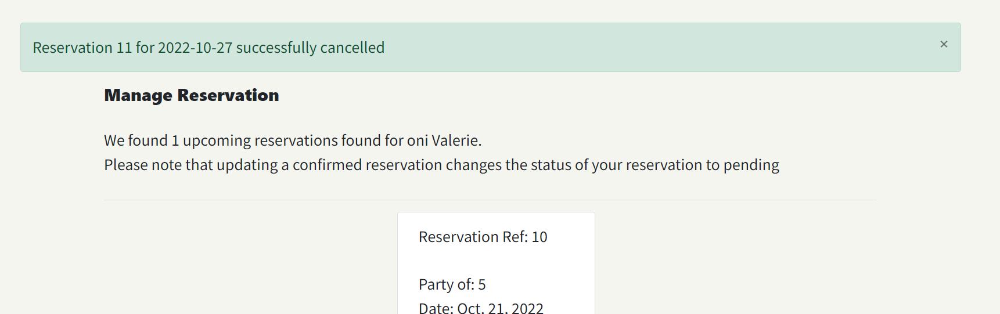
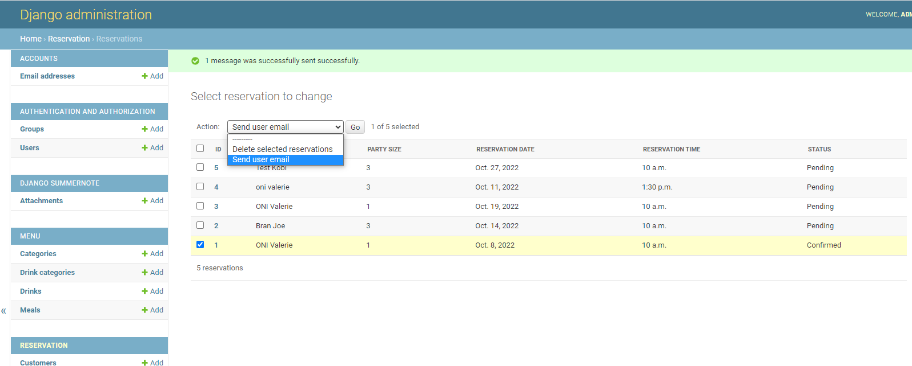

# Hearty Dove Restaurant

Hearty Dove Cuisine is a website designed to reduce no-shows by providing a reservation system that allows customers easily make and manage reservations at Hearty Dove Cuisine. It is useful for friends and families who like to dine and socialise out knowing that their reservation is confirmed.


## UX

## Strategy

### User Goals
The two users groups are the:
- restaurant owner would like to be able to accept online reservations.
- the customers visiting the restaurants - wants to make a table reservation for a specific date and time.

### User stories
- Customer's goals:
  - As a user, I am able to find the information I am looking for with ease.
  - As a user, I can view the menu the restarant has to offer.
  - As a user, I can make enquiry from the website by filling out a contact form.
  - As a user, book reservation at the restaurant's website for a number of people at a specific date and time.
  - As a user, I can make a reservation as a guest user
  - As a user, I am prompted to create an account during or after making a reservation so I can manage my reservation
  - As a user, I can get feedback about my reservation after completing the reservation.
  - As a user, I can register an account so that i can easily modify or cancel my reservation
  - As a regsitered user, I can sigin to my account and update my customer details
  - As a logged in user, I can view my past or upcoming reservations.

- Admin User's goals:
 - As an admin user, I can easily login and logout
 - As an admin user, I can login in order to access the admin dashboard
 - As an admin user, I can update the menu item from the backend
 - As an admin user, I can add and update dining hours
 - As an admin user, I can add or modify a table so that it would be easy to assign customers to tables
 - As an admin user, I can view list of reservations
 - As an admin user, I can approve or decline a reservation
 - As an admin user, I can allocate confirmed reservations to tables so consumers don't keep making bookings
   when there are no available tables for their party size, date and time.

## Scope 
The following features will be implemented, in order to achieve the user and business goals: 
- Responsive navigation links and a landing page for the restaurant
- Reservation form
- Registration to allow users to register and sign in
- User's profile that lists upcoming reservations
- manage reservation page where logged in users can update thier reservation
- Reservation confirmation via email
- contact form for making enquiries
- Admin login and logout
- updating option on the Admin Dashboard for adding and modifying menu items
- Reservation management page from the Admin dashboard for assigning tables to a reservations
- prevent user from double booking

The following features are nice to have but would not be included in this release
- Appointment reminders
- Push notifications for each booked table

## Structure

### Skeleton
[Wireframes for the restaurant website can be viewed here](docs/wireframes/frontend.pdf)

[User story board](https://github.com/valerieoni/hearty-dove-restaurant/projects/1)

### Database 
[Entity Relationship Diagram](docs/data_model/restaurant_reservation.png)


## Features

### Navigation
The site has top naviation links grouped into three: the brand name, the four main links in the middle and the reigstration links to the right.
**Menus**: Displays the list of menu available.

### Reservations
The reservation page contains the customer and reservation model forms. When a user makes a reservation the status is set to pending. This is updated by the admin user who also sends reservation status mail to selected customers from the admin page




---
A user has to log in to update or cancel thier reservation

**Update Reservation**



**Cancel Reservation**



**Admin Send Email Action**



## Technologies Used
- [Django](https://www.djangoproject.com/) - used to build the over project and its apps.
- [Python](https://www.python.org/) - the core programming language used to write all of the code in this application to make it fully functional.
- [Bootstrap](https://getbootstrap.com/) - used for creating responsive design.
- [GitHub](https://github.com/) - used to store code for the project after being pushed.
- [Git](https://git-scm.com/) - for version control by utilizing the Gitpod terminal to commit to Git and Push to GitHub..
- [Gitpod](https://www.gitpod.io/) - used as the development environment.
- [Heroku](https://dashboard.heroku.com/apps) - used to deploy application.
- [Lucid](https://lucid.app/documents#/dashboard) - used to designing the data model for the project.
- [Cloudinary](https://cloudinary.com/) - used to store all of my static files and images.
- [Favicon.io](https://favicon.io/) - used to create favicon's for my website
- [SQLite](https://www.sqlite.org/index.html) - used as the database on environment other than the production environment.
- [PostgreSQL](https://www.postgresql.org/) - used for the production database on Heroku.
- [PhoneNumber](https://pypi.org/project/django-phonenumber-field)
- [Temp Mail](https://tempail.com/en/) - to create temporary email when testing

## Testing
The W3C Markup Validator and W3C CSS Validator was used to validate the site to test for and fix syntax errors in the project.
- [W3C Markup Validator Result](docs/testing/W3C_Validation.png)
- [Html checker](docs/testing/HTML_checker.png)

### Automated Testing
I have test scripts written for the models, views and forms. The test files have been named accordingly so that test written for views are in test_views.py file. Coverage package was used to view how much of the application has been tested. From the report 81% of the app has been tested and the snapshot of the html report can be viewed [here](docs/testing/coverage_report.jpeg)
To run the report from the app:
- from the terminal run `coverage run manage.py test`
- `coverage report`
- To create and view the html report run `coverage html` This generates htmlcov directory containing index.html file
  - `coverage html`
  - `python3 manage.py -m http.server`
  - click on open browser and click on htmlconv to view the report

To generate your own coverage report from the command line:

1. Install the package using `pip3 install coverage`
2. Run `coverage run manage.py test`
3. Then `coverage html` to generate the report
4. You can view the report in a browser by using the command `python3 -m http.server` and opening the `index.html` file from inside the `htmlcov` folder.

### Bugs and fixes
- deployment error Failed to build backports.zoneinfo: - added a runtime.txt file to specify the Python version

## Deployment

### Clone GitHub repository

1. Log in to GitHub and locate the [GitHub Repository](https://github.com/valerieoni/hearty-dove-restaurant)
2. Click the `Code` dropdown arrow button just above the list of files.
3. To clone the repository using HTTPS, under "Clone with HTTPS", copy the link.
4. Open a terminal on your computer
5. Change the current working directory to the location where you want the cloned directory to be made.
6. Type `git clone`, and then paste the URL you copied in Step 3.

```
$ git clone https://github.com/valerieoni/hearty-dove-restaurant
```

7. Press Enter. Your local clone will be created.
8. Create creds.json file in the root directory and save Google credentials in the file
9. Rename .env.example to .env and update the file with your Nutritionix API ID and KEY values


### Heroku

The project was deployed to [Heroku](https://www.heroku.com/).

#### Prerequisites:
- you forked or copied this project into your repository on GitHub.
- Heroku requires these files to deploy successfully, they are both in the root folder of the project:
  - `requirements.txt`
  - `Procfile`
- you already have a Heroku account, or you need to register one.

#### Create a Heroku App
Follow these steps to deploy the app from GitHub to Heroku:
- Sign in to  Heroku. Signup if you do not have an account.
- From the Heroku dashboard, click on **Create New App**, give it a platform-unique name
- choose region, click on **Create app** button
- Click on **settings** tab
  - click on **Reveal config vars** button
  - add environment variables. The required variables are in the env_example.py file
- Click on the Deploy tab and select GitHub as the deployment method and click **Connect to GitHub** button
- In the GitHub authorization popup window login into GitHub with your GitHub username and click on `Authorize Heroku` button
- Type in your repo name and click `search`. It lists your repos. Choose the one and click on `connect` next to it.
- select the branch you want to deploy from the drop-down menu beneath **choose a branch to deploy**
- either enable automatic deployment on every push to the chosen branch or stick to manual deployment
- for the manual deploy, click on **Deploy branch** button and when the deployment is complete, click on **View** button to start the program

## Credits
During the process of building this project, I used a number of online resources to help me resolve challenges:
- [configuring database for different environment](https://stackoverflow.com/questions/47579644/django-configuring-different-databases)
- [fix for backports.zoneinfo error](https://django.fun/qa/325508/)
- [specifying a Python runtime](https://devcenter.heroku.com/articles/python-runtimes)
- [types of drinks](https://en.wikipedia.org/wiki/Drink)
- [styling django forms](https://www.youtube.com/watch?v=6-XXvUENY_8)
- [stack overflow](https://stackoverflow.com/questions/18619577/using-django-admin-actions-to-send-bulk-emails)
